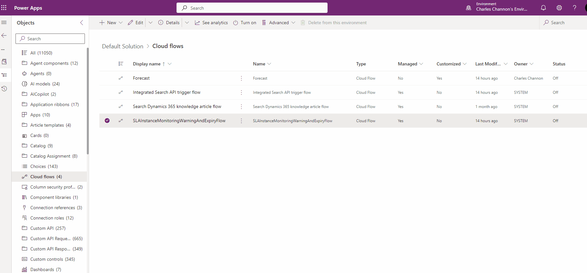

# ActivateFlows

This project demonstrates how to activate flows in Microsoft Power Platform's Dataverse using the Dataverse Client.

## Prerequisites

- [.NET 6 SDK](https://dotnet.microsoft.com/download/dotnet/6.0)
- [Visual Studio 2022](https://visualstudio.microsoft.com/vs/)

## Setup

1. Clone the repository:

2. Open the solution in Visual Studio:
    ```sh
    .\ActivateFlows.sln
    ```

3. Configure the `appsettings.json` file with your Dataverse connection details:
    ```json
    {
      "ConnectionStrings": {
        "default": "AuthType=OAuth;Url=https://yourorg.crm.dynamics.com;RedirectUri=http://localhost;AppId=51f81489-12ee-4a9e-aaae-a2591f45987d;LoginPrompt=Auto"
      }
    }
    ```

## Build and Run

1. Build the solution
2. Run or debug the application:
    
## Usage

When you run the application, it will prompt you to list inactive flows, activate them, or exit. Follow the on-screen instructions to manage your flows.



## Key Files

- **[Program.cs](ActivateFlows/Program.cs)**: Contains the main logic for listing and activating flows.
- **[appsettings.json](appsettings.json)**: Configuration file for connection strings (must exist in the active bin).

## Dependencies

- `Microsoft.Extensions.Configuration.Json`
- `Microsoft.PowerPlatform.Dataverse.Client`
